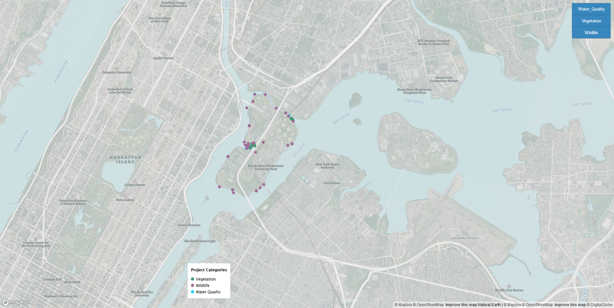

#  "Park-as-Lab" Interactive Map for Randall's Island

### The mapping project was completed as part of an internship with Randall's Island Park Alliance. 

### This is a visualization of the program's efforts and projects called, "Park-as-a-Lab", which can be found <a href="https://randallsisland.org/things-to-see-do/park-as-lab/">here</a>.

* The project was built using javascript, and the Mapbox GL API.
* Npm was also used for package management. 
* The map can be used by inserting your own Mapbox access token in line 135 of the code.
